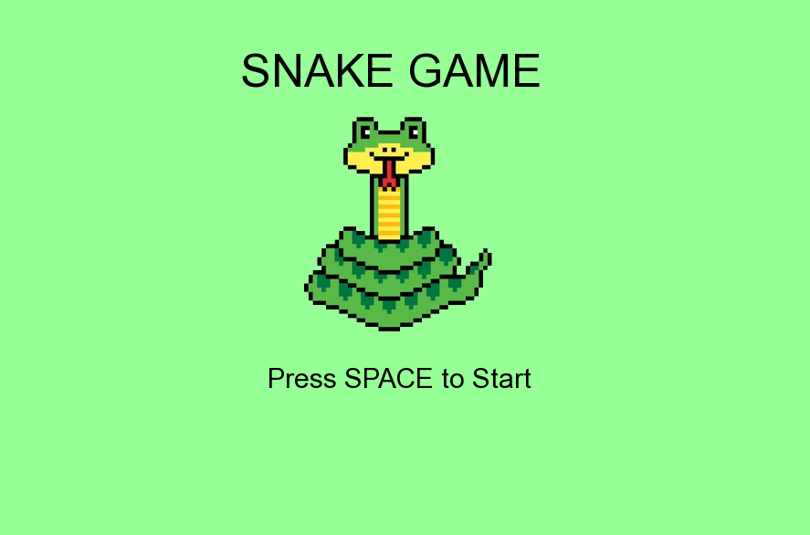

# Snake

Simple snake game written in C++ SFML and Make on Linux.


## Run Locally

OS: Linux Ubuntu 18.04 LTS


Installed tools:
 - g++: C++ compiler.
 - Make: Build automation tool.
 -  SFML: A multimedia library for creating games and graphical applications (graphics, sound, and windowing).

To install all required tools and libraries, run the following commands
```bash
  sudo apt update
  sudo apt install g++ make libsfml-dev
```


Clone the project

```bash
  git clone https://github.com/piotrnowacki02/Snake.git
```

Go to the project directory

```bash
  cd Snake
```

In the project root directory, use the following command to compile the game:

```bash
  make
```

After compilation, you can run the game with the following command:

```bash
  ./snake_game
```

## Screenshots
|  |  |
|---|---|
